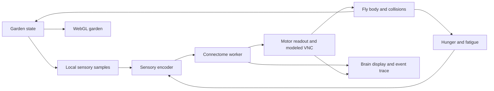

**Fly world simulator: implementation plan**

Build a small, living walled garden viewed through Three.js/WebGL: fruit trees drop ripe fruit, spiderwebs occupy tempting routes, and one fly explores, feeds, startles, retreats, and rests. The central demonstration is a hungry fly approaching fruit near a web, responding to danger, and changing its behavior as its hunger and defensive state evolve. The environment supplies sensory signals; neural activity and a documented motor adapter produce the response.

This is an implementation plan, based on a source review and local checks on September 10, 2026. No simulator implementation is included.

**What the repository already provides.**

| Component | Current implementation | Implication for this work |
|---|---|---|
| Fly and habitat | [js/main.js](js/main.js) draws the fly and food with Canvas 2D. Movement, feeding, input, animation, and screen bounds share this file. | Extract simulation state before adding garden rendering. |
| WebGL foundation | [js/brain3d.js](js/brain3d.js) uses the bundled Three.js **r128** and OrbitControls; [js/neuro-renderer.js](js/neuro-renderer.js) uses a separate WebGL2 context for neurons. | Reuse the installed Three.js stack and existing brain displays. There is no existing WebGL world scene to extend. |
| Neural simulation | [js/sim-worker.js](js/sim-worker.js) runs a leaky integrate-and-fire network, normally at 10 Hz. | Keep neural computation in the worker. |
| Brain/body interface | [js/brain-worker-bridge.js](js/brain-worker-bridge.js) injects group stimuli, aggregates spikes, and synthesizes virtual ventral nerve cord motor outputs. | Extend this interface with graded, directional sensory input and independently inspectable motor output. |
| Behavior and drives | [js/fly-logic.js](js/fly-logic.js), [js/connectome.js](js/connectome.js), and `main.js` supply behavior thresholds, hunger, fear, fatigue, feeding, flight, and grooming. | Reuse body animations and physiological state, while replacing world-aware steering shortcuts. |
| Existing integrations | [js/caretaker-bridge.js](js/caretaker-bridge.js) exposes food placement and other actions in screen coordinates. The iOS app bundles the website into WKWebView. | Coordinate migration and bundled asset loading are part of the implementation. |
| Verification | `node tests/run-node.js` passed **99/99 tests** during review. | Preserve useful regression coverage and add actual worker/world integration scenarios. These tests do not establish emergent garden behavior. |

The locally available data contains **139,255 neurons and 2,698,236 edges**; the binary header agrees with the JSON counts. However, **31 of 63 groups are empty**, including `VIS_LC`, `NOCI`, `MB_MBON_AV`, `MB_DAN_PUN`, `LH_AV`, and every `DN_*` group. `GNG_DESC`, food olfactory neurons, and sweet gustatory neurons are populated. These are findings about the local artifacts, which live under gitignored `data/`, rather than a guarantee about a fresh checkout.

There are four important limitations to address:

- `computeMovementForBehavior()` looks up the nearest fruit and steers directly toward its coordinates; phototaxis steers toward the screen center. These paths bypass directional neural processing.
- The virtual motor layer generates nearly symmetric walking outputs with random jitter. Naming groups for navigation does not currently provide directional navigation.
- `DRIVE_FEAR` is injected directly into the virtual motor layer. Adding a web proximity flag to this shortcut would demonstrate a programmed reflex, without establishing a connectome contribution.
- Neural weights are fixed during simulation. Mushroom body group names and recurrent activity do not establish learning or remembered locations.

The current `SPEC.md` describes an earlier, smaller application. Use the source as the integration baseline and update product documentation when the garden is implemented.

**The garden to build.** Start with a stylized miniature orchard, approximately **120 × 90 fly body lengths**, with deliberately compressed tree scale so both the fly and its habitat remain legible. Use a warm stone wall, moss, soil, scattered leaves, fruit colors, and pale silk. Keep the fly recognizable through its red eyes, moving antennae, six legs, wings, and extending proboscis.

```text
                         NORTH STONE WALL
     +---------------------------------------------------+
     | Fig tree / safe fruit       Apple tree            |
     | fallen ripe fruit           rich fruit patch      |
     |        open route         WEB A: low branches     |
     |                                                   |
     |                 sunny clearing                    |
     |                 fly starts here                   |
     |                                                   |
     | shaded leaf shelter       trellis + WEB B          |
     | resting area              alternate route around  |
     +---------------------------------------------------+
                    SOUTH WALL / VIEWING EDGE
```

| Area | Objects and sensory role | Behavior to investigate |
|---|---|---|
| Safe orchard | A fig tree, several fallen fruits, weak obstacles, and a clear approach. | Odor-guided approach, contact feeding, and reduced food seeking after satiation. |
| Risky orchard | A more fragrant fruit patch near a visible web between low branches. Both a direct and a longer open route remain possible. | Competition between attraction and avoidance; variable approaches and retreats. |
| Trellis corner | A second web with different orientation, partly occluded by foliage. | Responses that depend on visibility and approach direction. |
| Clearing | Open ground, soft breeze, and a broad light gradient. | Exploration, orientation, and short escape flights. |
| Shelter | Leaves and shade with room to land and walk. | Resting and recovery under different fatigue/light conditions. |
| Perimeter | Solid walls, rounded collision corners, and a lightly indicated mesh roof. | Containment and obstacle responses without screen-edge steering. |

Use two or three trees, two webs, and roughly 8–12 edible fruit portions initially. Keep fruit replenishment slow, seeded, and capped so the garden remains interesting without accumulating objects indefinitely. Store the authored layout and parameters as data. Named areas above are descriptions for viewers; they must not become destination labels available to the fly controller.

Render the scene in 3D, with a constrained body model for the first release: ground walking and short flights with real altitude, takeoff, and landing. Tree trunks and walls have collision volumes; webs have oriented contact surfaces. Fruit on the ground is edible, while attached canopy fruit becomes available after falling. Branch climbing and unrestricted aerial navigation can follow later.

Keep maximum flight altitude below the enclosure roof, and walls high enough to contain it. Fade the wall nearest the camera for visibility while retaining its collision shape. Camera pan, zoom, resize, or following the fly must never move the fly, fruit, or walls in simulation coordinates.

**Rendering and interaction.** Use the existing r128 `THREE.WebGLRenderer`, local vendor scripts, and IIFE/global-module conventions. A framework migration, new build system, and Three.js upgrade are unnecessary prerequisites.

- Add a `WorldRenderer` owning the garden scene, camera, lighting, picking targets, and mesh registry. Start with an oblique orthographic overview and optional follow camera; use the existing OrbitControls for constrained orbit/pan/zoom.
- Build trees, walls, fruit, and the articulated fly from reusable geometries and materials. Instance repeated leaves, stones, and fruit where practical. Use simple shadows and restrained transparency; avoid expensive postprocessing initially.
- Generate webs from radial spokes and curved spiral strands. Share the same web transform between their visible geometry, sensory representation, and collision surface. Add subtle strand motion to make them readable.
- Preserve the existing fly animation parameters where useful, driving Three.js body parts from body state. Wings animate in flight, legs follow walking speed, and proboscis extension requires feeding output.
- Introduce a separate world canvas; the existing canvas already owns a 2D context. Retain a simplified Canvas 2D renderer of the same world model as a capability fallback.
- Keep the neuron panel available below the garden and the existing Brain 3D view on demand. Suspend obscured render loops and dispose replaced scene resources. Measure the combined cost of all three possible WebGL contexts before considering renderer consolidation.
- Use raycasting against ground and designated interaction meshes for fruit placement and inspection, following the established [Three.js picking approach](https://threejs.org/manual/en/picking.html). A tool click places fruit or applies a stimulus; a drag controls the camera. Include touch equivalents and keyboard camera reset/follow controls.

The default interface should offer **Observe, Place fruit, Place/remove web, Follow fly, Pause, Reset**, plus the existing light, temperature, touch, and air controls. Overlay toggles expose scent, sensed danger, the fly's trail, and neural activity. Use object selection to show fruit ripeness/remaining food or web visibility/contact information. Decorative labels and tooltips should explain what is happening in familiar language.

**Simulation architecture.** Separate world state from drawing and from the neural adapter. Proposed modules and responsibilities:

| File | Responsibility |
|---|---|
| `js/world-config.js` | Layout, entity definitions, simulation units, and tunable parameters. |
| `js/world-state.js` | Entity IDs, transforms, fruit lifecycle, seeded randomness, reset, and serializable state. |
| `js/world-physics.js` | Body integration, ground/altitude constraints, swept collision tests, contacts, and landing. |
| `js/world-senses.js` | Odor samples, visible contrast, threat expansion, local light/wind, and contact signals. |
| `js/world-brain-adapter.js` | Sensory encoding, neural readout, explicitly modeled motor adapters, and pathway diagnostics. |
| `js/world-renderer.js` | Garden scene, meshes, fly animation, camera, and picking. |
| `js/world-inspector.js` | Observation overlays, event timeline, and experiment controls. |
| `js/simulation-clock.js` | Fixed simulation time, brain-step scheduling, pause, replay, and speed controls. |

`main.js` becomes the application coordinator. Existing brain files remain responsible for neural simulation, and `fly-logic.js` becomes a body/behavior policy that consumes motor outputs and local contact state. It must not receive tree locations, fruit destinations, or a route planner.



Use body lengths and seconds, with a single world-axis convention: ground `x/z`, altitude `y`, heading around the vertical axis. Convert legacy canvas coordinates only at compatibility boundaries. Define fruit bite range and wall clearance using the fly's body size, replacing the existing 20/50-pixel assumptions.

Use fixed 60 Hz body steps and initially 10 Hz neural steps, with rendering interpolated independently. Add explicit worker `step` requests and responses carrying step IDs. At each 100 ms simulation boundary, synchronize the neural result and sensory input before advancing the next block of body steps. Permit only one outstanding neural step; under load, slow simulation wall-clock progress rather than changing neural dynamics silently. Benchmark whether the resulting neural response latency is sufficient before increasing neural frequency.

Convert drive rates, cooldowns, feeding, and stimulus expiry to simulation time. Preserve existing intended drive timescales during conversion; for example, current fear retention of `0.85` per 500 ms becomes `0.85^(dt/0.5)`. Pause world and brain together when hidden. Resume preserved state without the current neural reset, reserving reset for an explicit new run. Replay needs the seed, model/data version, initial brain/body state, and timestamped interventions; a garden seed alone is insufficient. Cosmetic randomness must use a separate generator from simulation randomness.

**Fruit should attract through smell and satisfy hunger through eating.**

Represent each fruit with position, ripeness, exposed edible amount, odor emission, and nutritional value. Use a progression of attached/unripe → fallen/ripe → fermenting → depleted. Accelerated ripening is a simulation parameter. Favor fallen, exposed, fermenting fruit as food. Experiments support both attraction to food odors and changes in olfactory attraction with hunger; the planned garden simplifies these mechanisms. [Ko et al., eLife, 2015](https://elifesciences.org/articles/08298)

For the first release, sum inexpensive distance-decaying odor sources, stretched downwind, rather than implementing fluid dynamics. Sample concentration at two antenna positions and retain recent samples for temporal changes. Odor should spread around an obstacle approximately; visual occlusion should not automatically switch smell off. Treat enclosure airflow as an explicit approximation.

Encode graded food odor into the available olfactory populations, with hunger modulating sensory gain. Taste stimulation requires actual contact with exposed food. Feeding output plus contact consumes food over simulation time, and **only consumed nutrition reduces hunger**. This fixes the current coupling where being in the `feed` behavior reduces hunger even during approach. Stop intake immediately when contact is lost or defensive output interrupts feeding; preserve partially eaten fruit.

**Spiderwebs should be threatening sensory objects.** A web should be visible in the garden and capable of frightening the fly before contact. Implement a configurable visual threat cue based on detectable strand contrast, apparent angular size, approach-driven expansion, distance, and line of sight. Web motion or an optional small spider movement can strengthen the cue. Contact supplies a separate mechanosensory pulse and physical drag.

Research supports visual looming circuits and directionally organized escape responses in flies. It does **not**, by itself, establish an innate spiderweb recognition circuit. Treat the mapping from visible web features to aversive input as an explicit design assumption and describe the fear meter as a modeled defensive state. [Dombrovski et al., Nature, 2023](https://pmc.ncbi.nlm.nih.gov/articles/PMC9849133/)

| Signal | Proposed neural entry | Required validation |
|---|---|---|
| Local food odor | `OLF_ORN_FOOD`, with graded/side-specific encoding where supported. | Confirm mapped cells and measurable downstream changes. |
| Sweet contact | `GUS_GRN_SWEET`. | Feeding activity depends on input and intake requires body contact. |
| Web contrast/expansion | Validated visual populations; `VIS_LC` is currently empty. | Resolve annotations or use an explicitly identified modeled sensory circuit. |
| Silk contact | `MECH_BRISTLE`; nociceptive input only if a supported model exists. | Contact pulse survives worker scheduling and produces an observable response. |
| Wind and local light | `MECH_JO` and supported visual populations. | Preserve direction and intensity rather than global booleans alone. |

Do not reuse `dangerOdor` as invisible web detection: that would grant a visual object an unexplained smell. Do not require a spider agent, web construction simulation, or lethal trapping in the first release. If the fly contacts silk, use a bounded snag/drag effect followed by release; this is an environmental mechanic, not evidence of learned escape.

Urgent defensive motor output must be able to interrupt feeding/rest/grooming minimum durations. Moderate threat should compete with attraction through graded neural/readout activity, with hysteresis to prevent rapid state flicker. Escape direction must depend on sensed threat direction and motor asymmetry. Physical collision resolution prevents penetration even when the controller makes a poor choice.

**Make directional control an explicit prerequisite.** The raw classification file contains left/right information, but the current binary exports only region and group IDs. Preserve hemisphere and stable neuron identity in a versioned metadata sidecar, and apply exactly the same reordering that the worker applies to neurons. Use audited cell identities/connectivity for more specific sensory and descending readouts when available. Soma coordinates alone do not establish retinal receptive fields or motor function.

The current broad classification also assigns all MBON-class cells to the approach group. Audit food/aversive labels and relevant visual/descending annotations before relying on those names. Request or obtain richer annotations if the existing columns cannot support a claimed mapping; never fill empty groups by arbitrary assignment.

Where anatomical directional mappings are unavailable, a small documented modeled sensorimotor circuit can provide a demonstrator, but label the contribution accurately. A full-connectome claim requires showing that changing or suppressing relevant neural activity changes approach/avoidance. Remove direct nearest-fruit steering, screen-center phototaxis, hunger-only feed entry, and drive-only escape shortcuts from that validated mode. Physical reflexes and motor decoding remain legitimate model components when their role is visible.

**Demonstrate emergence with experiments.** These are hypotheses and acceptance targets, not guaranteed outcomes of the current connectome. Include a live trace of sensory intensity, selected group activity, motor output, behavior, and body contacts so a viewer can follow an encounter.

| Experiment | Conditions to compare | Evidence to collect |
|---|---|---|
| Hungry versus satiated | Same garden and seed, different initial hunger. | Food-contact latency, intake, and time near fruit. |
| Fruit beside a web | Same fruit patch with the web present/absent, then different hunger states. | Closest approach, retreats, feeding interruptions, and alternate trajectories. |
| Hidden versus visible web | Same distance, different occlusion or facing direction. | Visual stimulus and neural response change with detectability. |
| Recover after a threat | Remove threat after one encounter. | Defensive activity subsides and exploration/feeding can resume. |
| Move fruit or change wind | Apply a logged intervention during exploration. | Odor samples change before corresponding neural/motor changes. |
| Neural controls | Silence food input, threat input, or relevant motor output separately. | The matching response weakens; unrelated functions remain measurable. |

Use repeated seeds and distributions rather than one selected trajectory. Include a broadly silenced neural-output control to reveal residual scripted navigation. Brain highlights must reflect recorded activity; explanations should say which signals rose or which motor output won, rather than inventing intentions. Keep full-connectome and fallback results visibly distinguished.

Learning is a later milestone: add a bounded, documented plasticity rule or associative memory model, then compare trained versus naive flies with learning enabled/disabled. Do not call revisiting fruit, temporary fear decay, or random route variation learned memory.

**Implementation sequence and completion gates.**

1. **Establish a trustworthy baseline.** Add a real-worker stimulus/readout harness, inspect relevant group counts and mappings, and record idle/food/contact/threat response ranges. Version and validate paired connectome assets, including neuron counts, index order, group sizes, and hashes. Document how ignored data is provisioned for fresh checkouts. Calibrate excitation/inhibition and motor gains against measured responses. Complete when each required pathway has evidence or an explicit modeling limitation; existing 99 tests remain green.

2. **Extract the world and clock.** Introduce world state, units, deterministic scheduling, body physics, local contacts, and a renderer interface while retaining the current visual presentation. Replace screen bounds and wall-clock feeding. Add compatible world commands for existing tools. Complete when resize/pan have no simulation effect, pause preserves state, replay is reproducible within defined tolerances, and the body cannot cross walls at maximum escape speed.

3. **Build the WebGL garden.** Implement the authored enclosure, trees, ground fruit, webs, camera controls, fly mesh, and simplified 2D fallback. Wire layout changes through the shared state. Complete when both renderers show the same object positions/contact surfaces and garden, neural panel, and Brain 3D can coexist without broken controls or resource leaks.

4. **Close the fruit/brain/body loop.** Add odor sampling, hunger modulation, contact taste, directional encoding/readout, feeding, and fruit depletion/replenishment. Remove coordinate-driven food seeking from the validated mode. Complete when controlled hungry/satiated runs show reproducible differences, actual intake accounts for hunger reduction, and olfactory suppression changes the approach response.

5. **Add web fear and competing motivations.** Add visibility/expansion cues, side-sensitive defensive response, contact drag, interruption rules, and the safe/risky orchard experiment. Complete when visible webs produce traceable avoidance, occlusion changes pre-contact sensing, feeding can be interrupted, the fly recovers, and neural controls demonstrate the source of the response. Avoidance must not be a universally forced outcome when attraction is also present.

6. **Ship observation tools and integration polish.** Add trace overlays, scenario presets, seed/reset controls, and logged experiments. Migrate caretaker actions/overlays and document the sensory/model limitations. Test desktop browsers, mobile Safari, and bundled WKWebView. Update README/SPEC and relevant task tracking to match implemented behavior. Complete when the showcase can be reproduced and the performance/capability checks below pass.

The smallest useful vertical slice is **one bounded patch, one fruit, one web, one fly, and a sensory → neural → motor trace**. Build and validate that slice before multiplying trees, decorative objects, or scenarios.

**Compatibility and performance requirements.**

- Route manual tools and caretaker commands through the same validated world command API. Version coordinates explicitly; retain old screen-coordinate commands through a camera conversion adapter. Publish world bounds/coordinate version with state. Update `CaretakerRenderer` to project world positions for its overlays.
- Tag world events with their source. Web-caused fear must not be attributed automatically to a recent caretaker action, and fruit on inaccessible branches must not count as available food in caretaker diagnostics.
- Keep procedural assets local. If new asset directories or neural sidecars are introduced, include them in both `ios/project.yml` and the checked-in Xcode project's web-asset copy phase. Verify fetch/decompression/worker behavior in the actual file-loaded WKWebView.
- Initial performance targets are 60 fps on the selected desktop reference device and 30 fps on the selected mobile reference device with the brain running. Record devices, browser versions, frame percentiles, worker tick time, message latency, memory, and draw calls. These are targets, not measured results from this review.
- Cap device pixel ratio; instance repeated geometry; simplify webs/foliage at distance; avoid full-neuron scans for world sensing. Reduce visual quality before changing simulation dynamics. Bound fruit counts and diagnostic history.
- Handle world WebGL failure/context loss and neural data/worker failure independently. Restore from shared world state, expose the active brain mode, and retain accessible controls. A simplified renderer should remain usable when WebGL is unavailable.
- Add focused tests for actual world/sensory/worker behavior, including blocked visibility, asymmetric cues, no eating without contact, interruption, containment, deterministic replay, and pause/resume. Extend `tests/run-node.js` as needed and add browser scenarios for rendering/input. Do not substitute copies of production arithmetic for integration coverage.

The first release is complete when a user can watch the fly discover and eat fruit, react to spiderwebs, resume activity after danger, and inspect how those outcomes depend on sensory input, internal state, and neural activity inside a coherent, explorable garden.
