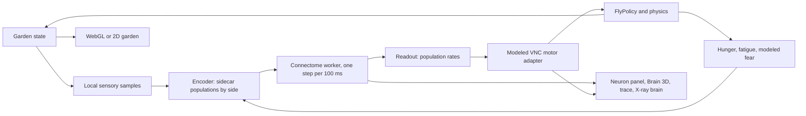

# The FlyBrain garden: world model, brain interface and limitations

The garden is a small walled orchard rendered with Three.js. Fruit trees drop ripe fruit, two spiderwebs hang across tempting routes, and a female and a male fly explore, feed, startle, retreat, rest, court and breed. The garden only supplies local sensory samples. Each fly runs its own copy of the FlyWire connectome, and neural activity, read out through a documented motor adapter, produces its response. Courtship, mating and egg-laying are modeled programs on top of that (see [Several flies](#several-flies-courtship-and-the-life-cycle)): FlyWire's brain is female, and both sexes run it.

This document says what is simulated, what is connectome-derived, what is modeled, and what is not established. Measured numbers live in [connectome-baseline.md](connectome-baseline.md) (pathway evidence and calibration) and [world-experiments.md](world-experiments.md) (behavioral experiments across seeds).

## Running it

Serve the repository over HTTP (the connectome is loaded with XHR and a Web Worker), for example `python3 -m http.server`, then open `index.html`. The iOS app bundles the same files and loads them from `file://`.

| Control | Effect |
|---|---|
| Observe | Click a fruit, web, fly, egg, larva or pupa to inspect it. Clicking a fly also focuses it: the views, X-ray brain, meters and trace follow the focused fly |
| N / Shift-N | Focus the next / previous fly |
| Fruit | Click the ground to drop a ripe fruit |
| Web | Click the ground to hang a web facing the nearest fly; click a web to take it down |
| Touch, Air | Touch the fly you click (head, thorax, abdomen, leg); drag to blow a two-second gust |
| Light, Temp | Bright / dim / dark; neutral / warm / cool |
| Follow, Pause, Reset | Follow camera; pause world and brain together; new run from the seed |
| Inspect | Live trace, event timeline, experiments (scenario, seed, steering mode, speed, silencing, replay, log export) |
| Overlays | X-ray (glass fly with the brain inside), Scent (odor field), Danger (webs the fly can see), Trail, Neural (odor and threat readouts around the fly) |
| Camera | Drag to pan, wheel or pinch to zoom, right-drag or two-finger twist to orbit, F follow, R reset, arrow keys pan when the garden has focus |
| Views | Garden (overview), Close-up (C: drag orbits the fly, wheel or pinch zooms to its brain), Fly's eyes (E: first person; drag looks around, wheel or pinch sets the field of view). Esc or R returns to the garden |

URL options make runs shareable and reproducible: `?seed=3&scenario=webPatch&mode=connectome`. `?flies=N` starts with N founders (alternating female and male, scattered around the clearing, at most 48). `?renderer=2d` forces the Canvas 2D renderer and `?brain=legacy` forces the fallback brain.

## Architecture

| File | Responsibility |
|---|---|
| `js/world-config.js` | Layout, units, species, tunable parameters, scenarios. All authored data. |
| `js/world-state.js` | Seeded RNG, entities (adult flies, brood, fruit, webs), fruit lifecycle, validated command API, source-tagged events, serialization, the per-fly focus |
| `js/world-physics.js` | Body integration, altitude limits, sub-stepped swept collisions (including fly against fly), web snag and release, landing |
| `js/world-senses.js` | Odor at two antennae, taste on contact, visual web cue per eye, touch, wind, light, modeled social cues |
| `js/world-life.js` | Modeled reproduction and life cycle: mounting, copulation, egg-laying, eggs, larvae, pupae, emergence, the population cap |
| `js/world-brain-adapter.js` | Sidecar parsing and validation, encoder, readout, modeled VNC motor adapter, brain backends (one brain per fly) |
| `js/fly-logic.js` | `FlyPolicy`: behavior states (including courtship and egg-laying), body commands, feeding intake, drives in simulation time |
| `js/simulation-clock.js` | Fixed 60 Hz body steps, 10 Hz neural steps, stalls, pause, speed |
| `js/world-sim.js` | One run: every fly's agent (brain slot, encoder, readout, motor adapter), settling, the neural/body schedule, traces, replay log, scenario triggers |
| `js/world-renderer.js` | WebGL garden, the focused fly as the articulated X-ray model, the other flies and the brood instanced, overlays, garden/close-up/eyes cameras, picking |
| `js/world-renderer-2d.js` | Canvas 2D fallback renderer of the same state |
| `js/world-inspector.js` | Trace, timeline, experiments, inspection, explanations |
| `js/main.js` | Application coordinator: brain loading, renderer selection, tools, the focused fly, UI, caretaker hooks |
| `js/sim-worker.js` | LIF network over the connectome; one brain per fly over the shared connectome; step and batch protocol with step IDs |
| `js/brain-worker-bridge.js` | Asset loading and validation; mirrors the focused fly's steps into the neuron panel and Brain 3D |



**Schedule.** Body physics runs at a fixed 60 Hz and the brain at 10 Hz, with rendering interpolated between body steps. At the start of each 100 ms block, `world-sim.js` does four things in order, for each fly in turn:

1. Applies the result of the previous neural step (readout, then motor adapter).
2. Updates drives and chooses a behavior.
3. Samples the senses, encodes them, and requests the next neural step (all flies' requests go to the worker as one batch).
4. Runs six body steps with the held motor output; after each, the life cycle (mounting, copulation, eggs, brood, emergence).

Motor output therefore lags its sensory input by one step, and only one neural step is ever outstanding. If a result is late, simulated time stalls (shown as "waiting for brain"); the clock never skips neural steps or changes their dynamics.

## Units and coordinates

Coordinate version `world-bl-v1`:

- **Units:** body lengths (BL; one BL is about 2.5 mm) and seconds.
- **Ground plane:** `x` runs west to east (0–120) and `z` runs north to south (0–90). `y` is altitude.
- **Heading:** `h` has forward = `(cos h, 0, -sin h)`. Positive yaw turns left (counter-clockwise from above). Three.js `rotation.y = h` for a model built facing +x.

Camera pan, zoom, orbit, resize, follow and a change of view move only a camera. Browser tests check the simulation fingerprint is unchanged by them. Screen coordinates appear only at the caretaker compatibility boundary.

## The garden

A 120 × 90 BL enclosure with rounded corners, 30 BL walls, and a mesh roof at 32 BL (flight is capped at 22 BL). It contains:

- **Fig tree (north-west):** fallen fruit with a clear approach.
- **Apple tree (north-east):** a fragrant, fermenting fruit patch. Web A hangs across the direct route from the clearing, 5–13 BL from the fruit.
- **Trellis corner (south-east):** web B, oriented differently and partly hidden by vine leaves and the lattice. A small plum tree is nearby.
- **Clearing:** the start position, in the sun.
- **Leaf shelter (south-west):** deep shade.
- **Breeze:** a soft breeze blows from the north-east.

Named areas are viewer labels only. A test checks that no simulation module reads them or the authored fruit and web layout.

**Fruit.** Fruit progresses attached/unripe, then fallen/ripe, then fermenting, then depleted:

- **Canopy fruit** ripens (accelerated) and falls to a seeded free spot under its tree.
- **Fermentation:** fallen fruit ferments after 120 s. It smells stronger and slowly loses edible amount.
- **Caps:** replenishment is slow, seeded and capped (18 objects, 12 on the ground).
- **Availability:** only exposed ground fruit is edible. Canopy fruit never counts as available food, including in caretaker diagnostics.

## Sensory model (`world-senses.js`)

**Odor (approximation).** Each exposed fruit is a steady point source. Its contribution decays exponentially (e-folding 8 BL) with an effective distance that is stretched downwind (×1.9) and compressed upwind (×1.6), and scales with ripeness stage and exposed amount.

- There is no fluid dynamics, plume intermittency or transport delay. A wind change reshapes the field on the next step.
- Obstacles do not block smell.
- The fly samples two antennae placed ±0.25 BL apart. That is about three times the real separation, a documented exaggeration that lets bilateral comparison work in a smooth field.
- The recent sample history is kept for temporal changes.

**Taste.** Sugar is sensed only while the head is within bite range (0.35 BL of the fruit surface) of edible fruit, on the ground. Smell alone never produces taste.

**Visual web cue (design assumption).** Flies have looming-sensitive visual circuits and directional escapes. An innate spiderweb detector is *not* established, so mapping visible silk to an aversive visual input is a modeling choice. Per web and per eye, the cue combines:

- **Apparent size:** 2·atan(r_eff/d), with foreshortening by viewing angle. It enters squared and capped, so a web's static presence gives at most mild avoidance.
- **Expansion rate:** from approach.
- **Contrast:** silk contrast times local light. Darkness removes the cue.
- **Line of sight:** five rays through trunks, stones, trellis lattice (55% transmission), vine foliage and canopies.
- **Motion:** subtle strand motion (or an optional spider).
- **Range:** a falloff beyond about 15 BL, fading to zero at 22 BL.
- **Eye coverage:** the eyes cover about 330°, with a 15° binocular overlap on each side and a rear blind sector.

The cue never uses the danger-odor channel.

**Touch and silk.** Contacts are latched until the next neural step encodes them, so short contacts survive worker scheduling:

- Silk contact and the Touch tool send a one-shot pulse plus sustained input on the touched side.
- Light bumps against walls or trunks give weak input only.

Silk contact also snags the fly: a bounded drag of 0.7–1.8 s, then release on the side it came from. The sheet stays a barrier. This is an environmental mechanic, not learned escape.

**Wind and light.** Antenna deflection is computed per side from the breeze plus gusts. Light per eye is the global level times local shade, with a small sun-direction asymmetry.

## Neural interface (`world-brain-adapter.js`)

### Assets and index order

`data/connectome.bin.gz` stores only region and group IDs per neuron. `scripts/build_neuron_sidecar.py` writes `data/neuron_sidecar.bin.gz` (root ID, hemisphere, population bitmask per neuron) and `data/neuron_sidecar.json` (version, counts, population provenance, audit notes, SHA-256 of the binary). Both are in the binary's original index order.

The worker reorders neurons with a stable group sort and reports `sortedToOriginal`. The adapter maps sidecar indices through it. At load, the app checks the following and shows the results in Inspect, Experiment:

- neuron, edge and group counts
- that the sidecar population counts reproduce after the reorder
- the connectome hash, when `crypto.subtle` is available

If any check fails, the directional populations are dropped rather than guessed.

### Encoding (senses → stimulus)

Graded recruitment: a larger signal recruits more of a fixed, shuffled population and drives each recruited cell harder (0.05–0.30 of threshold per tick).

| Signal | Population (sidecar unless noted) | Notes |
|---|---|---|
| Food odor, per antenna | `ORN_FOOD_L` / `_R` (912 / 925 ORNs) | Hunger scales gain 0.25–1.5; receptor adaptation (4 s) divides by a running level |
| Sugar contact | `GRN_SUGAR` (sugar/water GRNs, 129) | Hunger scales gain 0.3–1.5. Not `GUS_GRN_SWEET`: see limitations |
| Web cue, per eye | `VPN_LOOM_PROXY_L` / `_R` (1,626 / 1,435) | LC/LPLC-like proxy by neuropil connectivity |
| Touch and silk, per side | `MECH_TOUCH_L` / `_R` | Pulse on strong contact |
| Wind, per antenna | `JO_WIND_L` / `_R` | |
| Light, per eye | `PHOTORECEPTOR_L` / `_R` | Bulk drive, as before |
| Temperature | `THERMO_WARM` / `THERMO_COOL` groups | |
| Hunger, fatigue | `DRIVE_HUNGER`, `DRIVE_FATIGUE` groups | The only populated drive groups |
| Curiosity | Tonic `CX_FC`, `CX_EPG`, `CX_PFN` | Carried over from the legacy bridge |

**Silencing** (Inspect, Experiment) zeroes food input (olfactory and gustatory), threat input (the visual web cue), or motor output (every neural motor term).

**Calibration.** The legacy weight normalization (one synapse = 6×10⁻⁵ of threshold) produced no propagation beyond stimulated cells. The garden uses 0.0035 per synapse (`WorldConfig.brain.synapseWeight`), chosen from the scan in [connectome-baseline.md](connectome-baseline.md):

- Odor, looming and touch pathways respond clearly.
- Lateral-horn background is near zero.
- Recurrent activity stays bounded.

**Settling.** Each run starts from a reset brain that runs 150 neural steps in clean air (light, wind and internal state only) before t = 0. The fly is introduced into the garden at t = 0. Settling is part of the logged initial brain state.

### Readouts

Rates are the fraction of a population firing per tick, smoothed per readout (0.25–1.5 s). Responses are measured above a baseline that follows the rate down quickly and up slowly (30 s; 120 s for olfactory readouts). Because of this, fixed anatomical left/right imbalances do not read as turns.

| Readout | Population | Used for |
|---|---|---|
| Walking drive | `DN_L` + `DN_R` (all descending neurons, by side) | Walking speed; light dependence is emergent |
| Odor salience | `LH_NEURON_L` + `_R` (lateral horn) | Gates odor steering; surge and klinokinesis |
| Threat | `DN_LOOM_RANKED_L` / `_R` (top 10% of DNs by 3-hop flow from the loom proxy) | Turning away; escape |
| Touch | `DN_TOUCH_RANKED_L` / `_R` | Turning away; escape |
| Feeding | `MN_PROBOSCIS` (24 brain motor neurons) | Feeding permission, with contact |

### Motor adapter and steering modes

FAFB has no ventral nerve cord, so converting brain activity into leg and wing movement is a **modeled VNC adapter**. Every term is listed in `MOTOR_CHANNELS` with its source. The trace shows each term's contribution live, colored by source.

| Term | Source | What it does |
|---|---|---|
| walkDrive | connectome | DN activity sets walking speed |
| threatTurn, touchTurn | connectome | Turn away from the side with the larger DN response (sign is an adapter assumption) |
| escape | connectome | Loom- and touch-ranked DN response above threshold; fear lowers the threshold by up to 20% |
| feeding | connectome | Proboscis motor-neuron response above threshold, with head contact |
| odorSurge, klinokinesis | connectome | A rising lateral-horn response speeds walking and straightens the path; a falling one increases turning |
| odorTurn | **modeled** | Turn toward the antenna that smells more, gated by the lateral-horn response |
| upwindTurn | **modeled** | Odor-gated turning into the breeze |
| wander, bouts | **modeled** | Pattern generator: exploratory turning noise; walking alternates with pauses |
| groom, brace | **modeled** | Grooming urge (`SEZ_GROOM` is empty); bracing against gusts |
| courtTurn | **modeled** | A courting male turns toward the female he sees (the male courtship circuit is not in this female connectome) |

The baseline found no lateralized odor signal at the projection-neuron, lateral-horn or descending-neuron level (receptor projections are bilateral). Left/right odor steering therefore exists only as the modeled `odorTurn` and `upwindTurn` terms. The steering mode controls whether they're on:

- **Connectome + modeled steering** (default, amber badge): all terms.
- **Connectome readout only** (green badge): `odorTurn` and `upwindTurn` are off. What remains comes from connectome readouts, the modeled VNC mapping, the pattern generator, and physical reflexes (collisions, the sugar-contact slowing reflex).
- **Fallback** (red badge): if the connectome or worker fails, the hand-authored 59-group model (`constants.js`) drives the same pipeline from the current garden state. It has no hemispheres and is not a connectome result.

With motor output silenced, the fly does not move at all: there is no residual scripted navigation (measured in experiment 6c).

## Behavior policy (`FlyPolicy`)

**States:** idle, walk, feed, groom, rest, startle (freeze, then escape run), fly, brace, snagged.

**Rules:**

- The policy consumes motor outputs, local senses and contacts. It never receives fruit, tree or web coordinates.
- Minimum durations and cooldowns are in simulation seconds, with hysteresis between entry and exit thresholds.
- Urgent defensive output interrupts any minimum duration.
- Feeding stops at once when contact is lost or defensive output rises.
- Intake is computed per body step with head contact. **Only consumed nutrition reduces hunger**, and partly eaten fruit keeps its remaining amount.

**Drives, converted from the legacy 500 ms tick:**

- **Hunger** rises 0.01/s.
- **Fear** is a modeled defensive state. It is driven by the neural threat and touch readouts above their noise floors, and decays with the legacy retention of 0.85 per 0.5 s (0.85^(dt/0.5)).
- **Fatigue** rises with movement (faster in the dark and in flight) and recovers at rest.
- **Curiosity** random-walks with the legacy variance.
- **Groom** accumulates and is relieved by grooming.

## Several flies, courtship and the life cycle

The default garden (scenario "Free garden") starts with a female and a male in the clearing. The experiment scenarios, and scenario "One fly", keep the single female the experiments were measured with; a single-fly run is identical to one before the garden held several flies (same seed, same fingerprint).

### One brain per fly

Every adult runs its own copy of the connectome. The worker holds the connectome's 2.7M synapses once (about 22 MB) and a small dynamic state per fly (voltage, fire state, refractory counters and group gating, about 0.84 MB), selected by a pointer swap before each fly's step. A fly stepped alongside others follows exactly the course it would take alone (Node test). At each 100 ms boundary all flies' brains step in one batch message, so there is still one neural step outstanding however many flies live, and the clock's stall rule is unchanged. Each fly also has its own encoder, readout baselines, motor adapter and trace.

The body, senses and policy code is written for one fly. `WorldState.focus()` points `state.fly`, `state.drives`, `state.behavior` and the other per-fly names at one fly's record while it is processed; these are not serialized, so a saved state stores each fly once. Adults are processed in a fixed order, and all randomness still comes from the seeded state generator, so runs with several flies replay exactly.

Flies are solid to each other: bodies bump and push apart, and a bump is a light touch like one against a trunk. A copulating pair is not solid to itself.

### What is modeled

FlyWire FAFB is a female brain. Males run the same connectome, because a full male connectome (Janelia's male CNS, 2025) is a separate dataset with its own pipeline; the male-specific courtship neurons (P1 and its partners) are therefore absent, and courtship is a modeled program. Nothing in it is fed to the connectome. The modeled parts, all labeled in the UI:

| Part | Model |
|---|---|
| Seeing a female | A male sees females in his visual field within 12 BL with a clear line of sight, and reads whether each is mature and whether she has recently mated (a mated female carries the male pheromone cVA). |
| Courtship (`court`) | A mature male who sees an unmated female, is not tired, and whose connectome escape output is quiet follows her: the modeled `courtTurn` term turns him toward her, and he keeps 0.55 BL between his head and her body. Within 3 BL he sings, holding out the wing nearer her. He gives up after 14 s, if she mates with another male, or if he loses sight of her for 1 s. |
| Acceptance (`accept`) | A mature, receptive female who hears song and whose connectome escape output is quiet stands still. |
| Mounting and copulation (`copulate`) | When a courting male reaches an accepting female he mounts her; the pair stays joined for 12 s (the real ~20 min would last about 2 s at this compression, lengthened so it can be seen). |
| Eggs | **Each mating gives exactly one egg** (`cfg.reproduction.offspringPerMating`; deliberately unrealistic, a real female lays dozens a day). A mated female does not accept again for 90 s (about a week) and until she has laid. |
| Egg-laying (`oviposit`) | A gravid female lays when her head touches fermenting fruit and her escape output is quiet. Her urge to lay (the `egg` drive) rises while she carries an egg and raises her olfactory gain as hunger does. After about 30 s of carrying she also lays on ripe fruit, as females that hold eggs accept poorer sites. |
| Development | Egg 15 s, larva 55 s (crawling over its fruit), pupa 60 s beside the fruit, then a new adult: roughly 13 s of garden time per fly day, about 9,000 times faster than at 25 °C. The offspring's sex is 50:50 from the seeded generator. Females mature 20 s after emerging, males 8 s. |
| New brains | A new adult's brain settles during the last 15 s of its pupal stage (150 neural steps in clean air, as the founders settle before t = 0), so it emerges with settled readout baselines. |

Courtship and egg-laying still depend on each fly's connectome: they need a quiet escape output, and walking, feeding, grooming, defense and odor responses are unchanged. In "Connectome readout only" mode the modeled odor steering is off but courtship still runs (like grooming and the pattern generator, it is a modeled program, not a steering term).

### The population cap

At most 48 flies exist, counting eggs, larvae and pupae, so every egg laid has room to become an adult. A gravid female in a full garden holds her egg (the Inspect panel and the population line show the count). Nothing dies: no life span, starvation or lethal webs. Growth is slow by design (one egg per mating), and in the authored garden it is also limited by food: fruit replenishes slowly, so as flies multiply they eat it before it ferments, and gravid females wait for a place to lay. Dropping fruit with the Fruit tool feeds them and, 120 s later, gives them fermenting fruit to lay on.

## Determinism, replay and logs

- **Randomness:** all simulation randomness comes from the seeded state RNG. Cosmetic randomness (leaf layout, strand wobble, antenna twitch) uses a separate generator.
- **Worker:** the step protocol is timer-free, so a run is a function of the seed, config version, data hash, initial brain state (reset + settle), initial world state, and interventions.
- **Interventions:** user, caretaker and experiment commands are applied before the neural boundary of the body step they are logged at.
- **Replay:** Inspect → Replay re-runs the current log from a reset brain and compares the final fingerprint at the same step. Node and browser tests check that it matches exactly.
- **Export:** Export log saves the log as JSON.
- **Pause:** pausing (or hiding the tab) stops world and brain together and resumes the preserved state without a neural reset.

## Views and the brain inside the fly

All three views draw the same state; switching views moves only a camera (browser-tested against the simulation fingerprint).

- **Garden:** the orthographic overview described above, with follow.
- **Close-up:** a perspective camera orbiting the fly. Its angle is kept in the fly's frame and follows the heading with a 0.6 s lag, so the camera swings round as the fly turns. Zooming in moves the aim from the whole body to the brain.
- **Fly's eyes:** first person from just in front of the head (0.31 BL up). The fly turns fast (130°/s at the 90th percentile of walking, up to ~650°/s in escapes), so the view follows the heading through two cascaded 0.12 s filters, easing into and out of turns. A drag looks around (grab-the-world) and relaxes back to straight ahead after release. The field of view is set horizontally (110° by default); real compound eyes see about 330°, so this is a window on part of that. The fly's body, its ring and the danger wedge (whose apex would be the camera) are hidden. An inset shows the brain from behind, so the fly's left is on the left.

In both close views the garden walls stand (they fade only in the overview), a sky dome replaces the dark background, and distance haze gives the fly-scale garden depth. Tools work as in the overview: a click places fruit or a web where the ground under the pointer is.

**X-ray (on by default).** The body becomes tinted glass, bright at grazing angles, and a dark lining behind the brain gives its glow contrast. Inside the head, every simulated neuron is drawn as a point:

- **Positions** come from `data/neuron_positions.*`, built by `scripts/build_neuron_positions.py` from the FlyWire Codex `coordinates.csv` (first listed point per neuron, in FAFB nanometres). They are stored in the connectome binary's original order and mapped through the worker's `sortedToOriginal`, like the sidecar. They are checked against the connectome hash and dropped if they do not match.
- **Orientation:** FAFB `z` (posterior) maps to the fly's back, `y` (ventral) to down, and `x` to the fly's right. FAFB image space is mirrored, so this puts neurons annotated `side=left` on the fly's left, the same side the senses stimulate. A Node test checks sides, dorsal/ventral and anterior/posterior order against known anatomy.
- **Scale:** the 814 µm-wide brain is drawn 0.26 BL across the optic lobes, about 80% of true scale for a 2.5 mm fly, to fit the model's head and eyes.
- **Colour** is the neuron's region type (blue sensory, purple central, amber drives, red motor), as in the neuron panel.
- **Spikes:** while X-ray is on, the worker returns its fire state with each step. With one tick per step, that is exactly the step's spikes. A neuron that spiked is drawn brighter and larger, decaying over 0.15 s of *simulation* time, so pausing freezes the picture and speed changes scale it. Requesting the fire state never changes the dynamics (Node test: identical fingerprints with and without it).
- **Brightness:** the per-point gain and the number of points drawn follow the brain's size on screen, so it reads the same at every zoom. A distant brain is drawn from an even random subset of neurons (a fixed shuffle, so any prefix is representative), and every drawn point stays above the 8-bit blending floor. Spikes share a brightness budget, like auto-exposure: a few spikes flash at full brightness, and a burst of thousands does not wash the brain out.

What it shows is the simulation: leaky integrate-and-fire spikes of the FlyWire connectome under the garden's stimuli, not recorded neural activity. Each neuron is one annotated point, not its morphology. The bright crescents at the outer edges of the optic lobes are photoreceptors, driven by the light level: dim or darken the garden and they fall quiet.

## Performance

The plan's targets are 60 fps on a desktop reference device and 30 fps on a mobile reference device with the brain running.

Measured by `node tests/browser/run-browser-tests.js --perf docs` ([browser-performance.json](browser-performance.json)) in headless Chrome 154 on an Apple M1 (8 GB), with the X-ray brain on:

- **Frame rate:** 60 fps with p95 frame time 16.7–16.8 ms, vsync-limited. This holds with the garden plus the 139K neuron view, with the follow camera, with Brain 3D open (three WebGL contexts), with the close-up zoomed onto the brain (all 139,255 neurons drawn), in the fly's-eyes view with its brain inset, and with 48 flies (`?flies=48`, the population cap).
- **Rendering load:** 157 draw calls and about 43K triangles in the overview with the pair, 165 with 48 flies: only the focused fly is drawn as its own model; every other fly and all eggs, larvae and pupae are instanced.
- **Brain:** 2.5–4.2 ms of worker time per 100 ms step for the pair, and 74 ms for 48 brains (about 1.5 ms each; one worker thread), with message round trips of 3–4 ms and 71 ms. The simulation keeps wall time (ratio 1.00) with zero stalls in every sample, including 48 flies. At the cap the worker is about three-quarters busy, so a slower machine would run the garden slower than wall time (shown as "waiting for brain") rather than skip neural steps; the cap was chosen so 48 brains fit one worker on this machine.
- **Main thread with 48 flies:** about 5 ms per 100 ms step for senses, policies, encoding and bodies (measured in Node), and a JS heap of about 50 MB.

Quality settings:

- Device pixel ratio is capped at 2.
- Lite mode drops shadows, uses pixel ratio 1, and caps the brain's fill to 3M pixels a frame (24M otherwise) by drawing fewer, brighter neurons.
- The garden render loop is suspended while Brain 3D covers it.

**Not measured:** mobile Safari and the bundled WKWebView on real devices. The "phone" sample is desktop emulation and says nothing about phone GPUs or CPUs; a phone may not run 48 brains in real time. Web and foliage level of detail is not implemented; the overview did not need it on this machine.

Neural latency: a sudden odor change reaches the antenna samples on the next step, the lateral-horn readout after about 1 s, and the turn command after about 1.5 s (experiment 5). Most of that is readout smoothing and network dynamics, not the 10 Hz step. A higher neural rate was not needed for the behaviors above.

## Data provisioning

The FlyWire CSVs, `connectome.bin.gz` and `neuron_meta.json` are tracked in git even though `data/` is otherwise ignored. The generated sidecar and neuron positions are tracked through `.gitignore` exceptions. A fresh checkout therefore has a matching set. To rebuild after changing classification rules or data:

```sh
python3 scripts/build_connectome.py            # connectome.bin.gz + neuron_meta.json
python3 scripts/build_neuron_sidecar.py        # sidecar; refuses to run if the binary's groups disagree
python3 scripts/build_neuron_positions.py      # positions for the X-ray brain; refuses to run if a neuron has none
node tools/connectome-baseline.js              # re-measure pathways and calibration
node tools/world-experiments.js --seeds 10     # re-run the experiments
```

The sidecar builder needs numpy; the positions builder needs only Python. The iOS copy phase (`ios/project.yml` and the checked-in Xcode project) bundles `connectome.bin.gz`, `neuron_meta.json`, both sidecar files and both position files. If the sidecar is missing or fails validation, the app still runs, labeled as having no directional populations. If the positions are missing or do not match the connectome, the X-ray fly is drawn without a brain, and Inspect → Experiment says why.

## Testing

- `node tests/run-node.js`: the original 99 regression tests plus world tests. The world tests cover determinism, containment at maximum escape speed, occlusion, asymmetric cues, taste only on contact, no intake without contact, interruption, the clock's one-outstanding-step rule, pause, camera independence, and the neuron positions format and axis mapping. For several flies they cover founders, serialization and the per-fly focus, flies not passing through each other, the social cues, the courtship and acceptance rules, one egg per mating laid on fermenting fruit, development to a new adult, and the population cap. With data present they also run real-worker integration tests: step protocol determinism, sidecar mapping, pathway responses, exact replay, pause/resume equivalence, hungry versus satiated, silencing, the fire state being display-only, the positions matching the connectome and the anatomy, brains in one worker staying independent in batches, a two-fly run replaying exactly, the default pair mating and laying one egg, and a new adult's brain settling in its pupa.
- `node tests/browser/run-browser-tests.js`: headless-Chrome scenarios over the DevTools protocol (no extra dependencies). They cover loading and asset checks, the X-ray brain (every neuron drawn, spikes arriving, toggling), real-time pacing, camera and view independence (garden, close-up, eyes, and the first-person camera sitting at the head), fruit clicks in the overview and first person, air drags, observation, hidden-tab pause, Brain 3D coexistence, WebGL context loss, the 2D renderer, the fallback brain, in-browser replay, `file://` loading, and phone-sized touch. Set `CHROME_PATH` to use another Chrome.

## Caretaker integration

State messages publish:

- `coordinateVersion: "world-bl-v1"` and the world bounds
- position in BL
- `food`: only reachable, edible fruit
- `canopyFruit`: unreachable fruit, counted separately
- `webs`
- `fearAttribution`: the source of the latest defensive rise (web, user or caretaker)

Commands use world coordinates (`{"coords": "world", "x": 60, "z": 40}`). Legacy screen-pixel commands are converted through the current camera. Every command goes through the same validated command API as the tools and is tagged `caretaker`. The server only logs "scared the fly" when the recorded cause is a caretaker action, never for a web.

## Limitations and open questions

- **Empty and mixed groups.** 31 of 63 groups are empty in this export, including every `DN_*` group, `VIS_LC`, `NOCI`, `MB_MBON_AV`, `LH_AV` and all leg and wing motor groups. None are filled by assignment. Other groups are mixed:
  - `GNG_DESC` mixes ascending and descending neurons.
  - `MB_MBON_APP` and `LH_APP` contain all MBONs and lateral-horn neurons regardless of valence.
  - The garden reads sidecar populations instead of these names.
- **Sugar receptors.** The build rule sends FlyWire `sugar/water` gustatory neurons to `GUS_GRN_WATER`, so `GUS_GRN_SWEET` contains no sugar receptors. Taste uses the sidecar `GRN_SUGAR` population.
- **Looming proxy.** `VPN_LOOM_PROXY` is selected by neuropil group (lobula or lobula plate to PVLP/PLP), not by verified LC/LPLC cell types. The loom-, touch- and odor-ranked DN readouts are ranked by input-normalized connectivity, not by identified cell types or function.
- **No lateralized odor readout.** The connectome's odor signal is strong in the lateral horn, weak at descending neurons, and not lateralized anywhere measured. Odor-guided *approach* in the default mode depends on the modeled `odorTurn` and `upwindTurn` terms. With connectome readout only, flies rarely find fruit (experiment 1). No full-connectome claim is made for odor navigation.
- **Modeled VNC.** Walking, turning, flight and proboscis extension from descending activity are all modeled. So are the escape direction sign (turn away from the stronger side), the fear state, grooming, bracing and the pattern generator.
- **Proboscis readout.** It has only 24 neurons with low rates at the calibrated weight, so it is integrated over about 1.5 s. Single spikes can briefly approach threshold.
- **Visual threat.** The web cue is a designed stimulus. Its responses are those of the connectome to that stimulus, not evidence of web recognition.
- **No learning.** Weights are fixed. Revisiting fruit, fear decay and route variation are not memory. A bounded plasticity rule with trained-versus-naive comparisons remains a later milestone.
- **Sexes and reproduction.** Every fly, male or female, runs the same female FAFB connectome. Courtship, acceptance, copulation and egg-laying are modeled programs (see [Several flies](#several-flies-courtship-and-the-life-cycle)), not connectome results; they are gated by each fly's connectome escape output only. Flies do not see or smell each other through the connectome (no looming response to another fly, no pheromone input), song is not sent to Johnston's organ, and larvae have no brain. One egg per mating, a compressed life cycle and no deaths are deliberate simplifications.
- **Body.** Walking and short flights only: no climbing, no canopy fruit access, no lethal trapping.
- **X-ray brain.** One annotated point per neuron, drawn at about 80% scale; the lamina and photoreceptor points sit where FlyWire annotates them, not in a modeled retina. The fly's-eyes view is a single perspective camera, not a model of compound-eye optics or the fly's visual field (the web cue in `world-senses.js` is what the brain receives). The 2D fallback renderer has neither.
- **Not tested here.** Real mobile devices and the WKWebView bundle. The `file://` browser scenario is only a proxy, because this machine has no Xcode.
